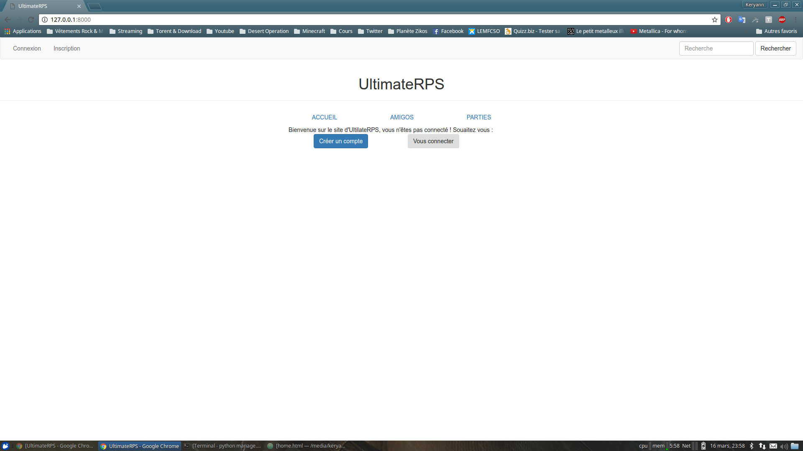

# UltimateRPS

## But du projet :
Ce projet a pour objectif de nous apprendre à utiliser Django et Bootstrap.
Pour cela, nous réalisons un "réseau social" de pierre-feuille-ciseaux.

Le but de ce site est de pouvoir défier ses amis à un pierre-feuille-ciseaux. On envoie pierre feuille ou ciseaux à son ami qui répond et ensuite les deux sont mis au courant de qui a gagné.
De plus, il doit être possible de pouvoir consulter ses parties précédentes, ses parties "en cours", ainsi qu'un leaderboard.

## Les membres du projets sont :
* Léo Boisson
* Keryann Bussereau
* Alizée Duran

## Installation du projet :
* Installer python (3.4 ou plus récent de préférence) `sudo apt-get install python3`
* Installer Django <https://docs.djangoproject.com/fr/1.10/topics/install/>
* Cloner le dépot `git clone https://github.com/lboisson/ultimateRPS.git`
* Se placer à la racine du dossier
* Lancer la commande `python3 manage.py runserver`
* Se rendre sur <http://127.0.0.1:8000> sauf si vous avez modifié ce paramètre dans django

Voici notre page d'accueil lorsque vous n'êtes pas connecté

